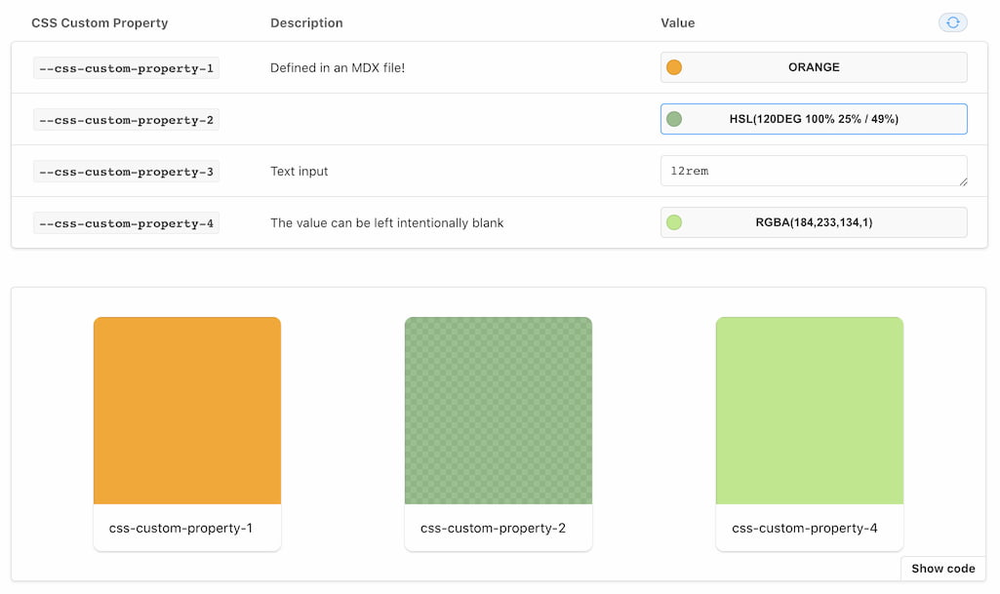

# Storybook CSS Custom Properties Addon

<p align="center">
  
</p>

```sh
npm i -D @ljcl/storybook-addon-cssprops
```

Enable the addon in [`.storybook/main.js`](https://storybook.js.org/docs/react/configure/overview#configure-your-storybook-project):

```js
module.exports = {
  addons: ["@ljcl/storybook-addon-cssprops"],
};
```

To use it inside MDX, or when customising the docs page:

```js
import { CssPropsBlock } from "@ljcl/storybook-addon-cssprops";
```

## Usage

Include your CSS Custom Properties without the intial `--` prefix, the addon will apply and document this automatically.

```jsx
export default {
  title: "Simple Component",
  parameters: {
    cssprops: {
      "css-custom-property-1": {
        value: "hsl(120deg 100% 25% / 49%)",
        description: "Optional description",
      },
    }
  },
} as Meta;
```

Controls default to colour, but can be switched to text by adding `cssprops.myparam.control: 'text'`.

Disable the picker with `cssprops.disable: true`

Customise preset colours for the colourpicker with `cssprops.presetColors: ['#FFF']`.

### Adding to DocsPage and MDX

#### DocsPage

Modify the docs page based by [following the storybook docs](https://storybook.js.org/docs/react/writing-docs/docs-page#remixing-docspage-using-doc-blocks). Including `<CssPropsBlock />` where you prefer.

## Development

This monorepo uses npm@7 workspaces, run `npm i` at the root.

### TODO

[] Auto detect input type.  
[] Look for the args of a defined component when in MDX  
[] Configurable per story localstorage.  
[] Better specificity when injecting styles (with & without iframes)
[] Functioning reset button.

## Credits

Portions of this package are sourced from the storybook source code in order to maintain look and feel.
