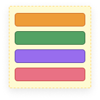

<p align="center">
  
  <h1>Storybook CSS Custom Properties Addon</h1>
</p>

<p align="center">
  
</p>

## Installation

```sh
npm i -D @ljcl/storybook-addon-cssprops
```

Enable the addon in [`.storybook/main.js`](https://storybook.js.org/docs/react/configure/overview#configure-your-storybook-project):

```js
module.exports = {
  addons: ["@ljcl/storybook-addon-cssprops"],
};
```

To use it inside MDX, or when customising the docs page:

```js
import { CssPropsBlock } from "@ljcl/storybook-addon-cssprops";
```

## Usage

Include your CSS Custom Properties without the initial `--` prefix, the addon will apply and document this automatically.

```jsx
export default {
  title: "Simple Component",
  parameters: {
    cssprops: {
      "css-custom-property-1": {
        value: "hsl(120deg 100% 25% / 49%)",
        description: "Optional description",
      },
    }
  },
} as Meta;
```

## Configuration

The addon can be configured wherever other [parameters](https://storybook.js.org/docs/react/writing-stories/parameters) can be configured (at the Global, Story, or individual story level). It will also attempt to detect between `colour` and `text`, this can be overriden by specifying the `control` property.

```ts
parameters: {
  cssprops: {
    // Disable the addon by setting disable to true:
    disable: false,
    // Override the detected default control type:
    "override-property-detection-type": {
      value: "green",
      control: "text",
      description: "Maybe you want 'green' for reasons differing to colour"
    },
    // Customise preset colours for the colourpicker
    presetColors: ['#FFF']
  }
}
```

### Adding to DocsPage and MDX

#### DocsPage

Modify the docs page based by [following the storybook docs](https://storybook.js.org/docs/react/writing-docs/docs-page#remixing-docspage-using-doc-blocks). Including `<CssPropsBlock />` where you prefer.

## Development

This monorepo uses npm@7 workspaces, run `npm i` at the root.

### TODO

- [ ] Look for the args of a defined component when in MDX
- [ ] Better specificity when injecting styles (with & without iframes)
- [ ] Reset the default values without requiring a page refresh (ArgsTable)
